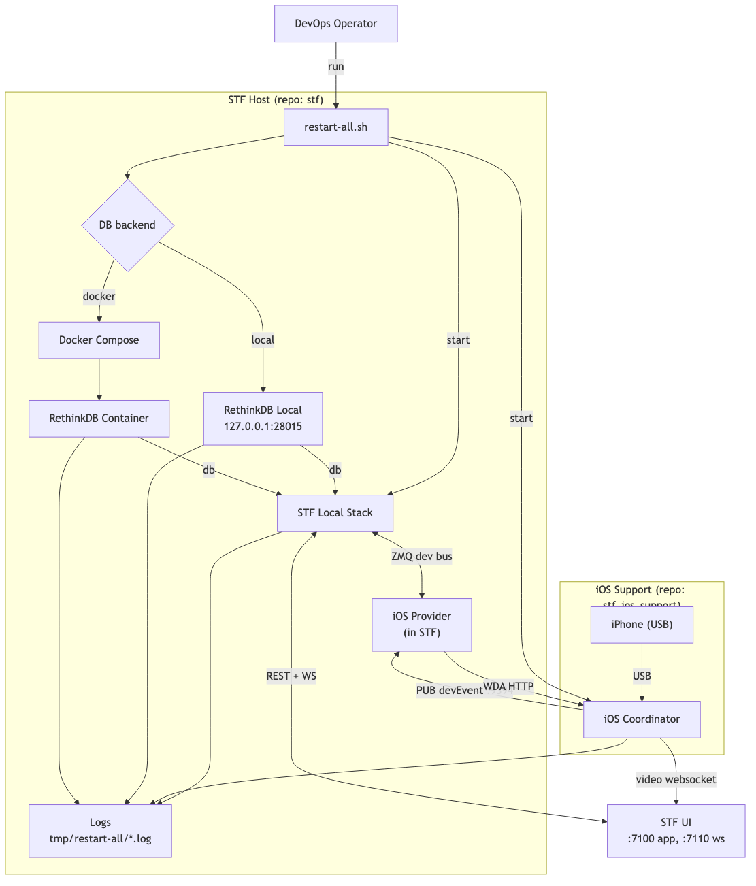

# STF Fork (Quick Guide)

## Topology Diagram



A practical fork of DeviceFarmer STF for local lab use.

- Android flow from upstream STF.
- Experimental iOS host-bridge flow via companion repo `stf_ios_support`.
- Samsung flashing pipeline enabled in safe mode by default (`dry-run`).

## Who This Is For

DevOps engineers bringing up STF in a local/dev environment.

## TODO
- Generalize bring up process
- Add AAOS device flashing
- Support Jenkins Automation

## What We Use In Development

- Node.js `22.11.0` (`.nvmrc`, `.tool-versions`)
- npm
- Docker + Docker Compose
- macOS iOS toolchain (for iOS path): Xcode, `ios-deploy`
- Companion repo: `$HOME/Projects/STF iOS/stf_ios_support`

## Fast Start 

From repo root:

```bash
cd /Users/naokiogishi/Projects/STF/stf
npm install
npx gulp clean build
./restart-all.sh
```

What this starts:

- RethinkDB (local binary or Docker, auto-selected)
- `stf local` with iOS + Samsung worker flags
- iOS coordinator from `stf_ios_support`

## Verify Startup

Use the exact URLs printed by `./restart-all.sh`.

Expected checks:

```bash
curl -I http://<printed-host>:7100
curl -I http://<printed-host>:7100/auth/mock/
```

Expected behavior:

- `7100` returns `302` to `/auth/mock/`
- `/auth/mock/` returns `200`

## Logs and Debug

Primary logs:

- `tmp/restart-all/rethinkdb.log`
- `tmp/restart-all/stf-local.log`
- `tmp/restart-all/ios-coordinator.log`

Tail all:

```bash
tail -f tmp/restart-all/rethinkdb.log tmp/restart-all/stf-local.log tmp/restart-all/ios-coordinator.log
```

Useful iOS readiness signals:

- STF log: `Introduced iOS device ...`
- Coordinator log: `WDA Running`
- Coordinator log: `Fetched WDA session`

## iOS Device Bring-Up (Current Flow)

1. Connect and unlock iPhone, trust host.
2. Confirm host sees device:

```bash
ios-deploy -c -t 1
```

3. Start stack with `./restart-all.sh`.
4. Open printed STF URL and verify device is online.
5. Validate controls: tap, home, type, screenshot.

## Docker-Only Path (No iOS Coordinator)

For baseline STF stack only:

```bash
docker compose up -d
docker compose ps
docker compose logs -f stf
```

Compose defaults:

- UI: `7100`
- WebSocket: `7110`
- Provider range: `7400-7500`
- RethinkDB host bind: `127.0.0.1:28015`

## Common Pitfalls

- Wrong `public-ip` causes bad redirects/login loops.
- iOS control depends on WDA; no WDA means screen-only behavior.
- Do not mix hosts (`localhost` vs `127.0.0.1` vs LAN IP) in one session.
- USB passthrough is required for real devices.

## Core Commands

```bash
# local STF only
npm run local

# build assets
npx gulp build

# clean + build assets
npx gulp clean build

# full local reset/restart flow used by this fork
./restart-all.sh
```

## Key Docs

- iOS runbook: `doc/IOS_SUPPORT_PLAN.md`
- iOS implementation notes: `doc/IOS_SUPPORT_PORT_PLAN_Mar032026.md`
- Samsung workflow: `doc/SAMSUNG_FLASHING_WORKFLOW_PLAN.md`
- Samsung test plan: `doc/SAMSUNG_FLASHING_TEST_PLAN.md`
- General deployment reference: `doc/DEPLOYMENT.md`
