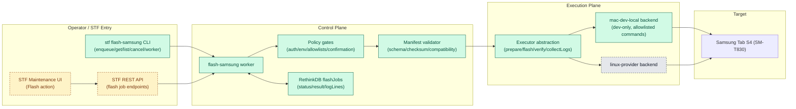

# Samsung Flashing Workflow Plan (STF)

## Objective

Provide a safe, auditable workflow in STF to manage Samsung tablet flashing jobs, starting with a non-destructive dry-run pipeline and evolving to real host-side flashing execution.

Target device for initial validation: `SM-T830` (`Galaxy Tab S4`).
Development requirement: preserve macOS-based local development and testing workflows.
Current constraint: Linux provider-host validation is not available in this cycle.

Near-term goal for this plan revision:
- Validate real execution flow on a guarded `mac-dev-local` backend.
- Defer Linux backend validation until Linux lab access is available.

## Architecture

- Control plane:
  - Job records in RethinkDB (`flashJobs` table)
  - CLI/API job creation and status inspection
  - Worker loop that claims queued jobs and drives state transitions
- Execution plane:
  - Backend interface with two execution targets:
    - `mac-dev-local` (current validation target, development/testing only)
    - `linux-provider` (deferred validation target, production path)
  - Phase 1: dry-run state machine (no partition writes)
  - Phase 2: integrate real mac executor behind policy gates (Heimdall/Odin workflow with allowlisted arguments)
  - Phase 3: add Linux executor and run parity validation once Linux test access exists
- Auditability:
  - Per-job status, progress, message, actor, provider, timestamps, result payload

### Topology Diagram (Implemented vs TBD)



Legend:
- `Implemented`: green nodes.
- `TBD`: amber dashed nodes.
- `Deferred`: gray dashed nodes.

## Backend Modes

- `mac-dev-local`:
  - Current primary backend for this test cycle.
  - Explicitly dev-only backend for local testing on macOS.
  - Supports iterative validation while Linux host testing is unavailable.
  - Must be protected by strict guardrails and operator opt-in.
- `linux-provider`:
  - Deferred backend in this cycle (not currently testable).
  - Requires direct USB access on Linux host.
  - Remains the intended production-like reliability and lab execution path.

## Phases

### Phase 1: Workflow Scaffolding (Executed in this change)

- [x] Add `flashJobs` table and indexes (`status`, `deviceSerial`, `createdBy`, `provider`, `createdAt`)
- [x] Add DB helpers:
  - create/get/list/cancel jobs
  - claim-next-queued job
  - status updates
- [x] Add `stf flash-samsung <action>` CLI:
  - `enqueue`, `list`, `get`, `cancel`, `worker`
- [x] Add `flash-samsung` worker unit:
  - claims jobs
  - validates device/package fields
  - performs dry-run completion
  - marks job failed for unsupported non-dry-run mode
- [x] Wire optional worker startup into `stf local`
  - `--enable-flash-samsung`
  - `--flash-samsung-poll-interval`
  - `--flash-samsung-execution-mode`

### Phase 2: mac-dev-local Execution (Current Focus)

- [x] Add executor abstraction layer:
  - common interface for `prepare`, `flash`, `verify`, `collectLogs`
  - backend selector per job (`mac-dev-local` first, `linux-provider` deferred)
- [x] Implement native mac backend (`mac-dev-local`) for development/testing only
- [x] Validate package manifest schema and checksums before execution
- [x] Enforce strict model/CSC/bootloader compatibility checks
- [x] Stream command progress/logs into job status (`flashJobs.logLines`)
- [x] Add policy gates for `mac-dev-local`:
  - explicit enable flag (off by default)
  - device allowlist
  - package allowlist
  - clear `DEV_ONLY_BACKEND` audit marker in job result

### Phase 2A: mac-dev-local Guardrails (Required Before Enabling Real Writes)

- [x] Require global flag `STF_FLASH_SAMSUNG_ENABLE_MAC_DEV_LOCAL=true` (or CLI equivalent `--allow-mac-dev-local`)
- [x] Require per-job `executionBackend=mac-dev-local`
- [x] Require explicit confirmation field for destructive operation
- [x] Block backend in non-development environments by policy
- [x] Add command denylist/allowlist checks to prevent arbitrary host command execution
- [x] Add prominent warning text in API/UI response payloads (job `message` + `result.warnings`)

### Phase 2B: Linux Backend Enablement (Deferred)

- [ ] Implement Linux backend (`linux-provider`) once Linux host test access is available
- [ ] Validate Linux USB ownership and mode-switch stability for download/flash/reboot cycle
- [ ] Run parity tests against mac-dev-local control-plane behavior (state machine, logs, error mapping)
- [ ] Keep policy default routing aligned with environment readiness

### Phase 3: STF API + UI

- [x] Add REST endpoints for flash job lifecycle
- [x] Add minimal maintenance-panel engineering action (UI -> websocket enqueue)
- [x] Add top-level synthetic `Samsung Flash Service` device card (service state + queue summary)
- [x] Add realtime progress updates to client
- [x] Add dedicated service-detail page (job history, controls, health checks)

### Phase 4: Hardening

- [ ] Add per-device locking semantics specific to flashing
- [ ] Add retry/cancel/timeout policies
- [ ] Add failure-recovery playbooks and rollback guidance

## Samsung Process Display Summary (STF UI)

Goal: make flash progress visible without requiring CLI access.

- Top-level service entry (`Samsung Updater`):
  - Show operational state: `online/offline`, worker health, backend mode.
  - Show queue counters: `queued`, `running`, `failed (24h)`, `succeeded (24h)`.
  - Provide direct navigation to detailed workflow view.

- Service detail page (`#!/services/samsung-updater`):
  - Queue/create form:
    - Target serial
    - Package reference / manifest reference
    - Execution mode (`dry-run` or `execute`)
    - Execution backend (`mac-dev-local` now, `linux-provider` later)
    - Destructive confirmation text (required for execute)
  - Live status panel:
    - Current worker/provider state
    - Policy gate state (enabled/disabled + reason)
    - Last poll/update timestamp
  - Job history table:
    - `jobId`, `deviceSerial`, `status`, `progress`, `message`
    - `createdBy`, `provider`, `executionMode`, `executionBackend`
    - `createdAt`, `updatedAt`, `startedAt`, `finishedAt`
    - Result code/warnings and cancel action where allowed
    - Row click opens selected-job detail/log panel
  - Job detail/log view:
    - Stage timeline (`queued -> running -> succeeded/failed/canceled`)
    - Streamed `logLines` for prepare/flash/verify stages
    - Detailed command I/O metadata per entry (`eventType`, `stream`, `command`, `args`, `pid`, `exit`, `durationMs`)
    - Final result payload (code, warnings, summary)

- Realtime behavior:
  - Service card and detail page poll every 2 seconds.
  - UI reflects state transitions as worker updates `flashJobs`.
  - Terminal job states are sticky (`succeeded`, `failed`, `canceled`) with persisted results.

- Current implementation status:
  - Implemented: service card route, detail page, queue form, history list, click-to-inspect logs, status polling, cancel path.
  - Deferred/TBD: richer per-job timeline visualization and Linux backend-specific health indicators.

## Validation Scope for Current Cycle

In scope:
- Dry-run pipeline verification in existing macOS + Docker STF setup.
- Executor abstraction and guarded `mac-dev-local` execution path.
- Policy controls and audit markers for dev-only destructive operations.

Out of scope (until Linux access is available):
- Linux backend execution validation.
- Production reliability claims for Samsung flashing.
- USB stability conclusions for Linux-hosted providers.

## What "Executed" Means in Phase 2

This pass keeps default behavior safe (`dry-run`) and adds a guarded execute path for `mac-dev-local`.

Execution behavior is explicit:
- `dry-run`: validates target/device and completes with `result.code = "DRY_RUN"`.
- `execute` + policy disabled: fails with policy code (for example `MAC_DEV_LOCAL_DISABLED`).
- `execute` + policy enabled + valid manifest: runs executor stages `prepare -> flash -> verify` and persists command/status logs.
- `linux-provider` remains deferred and not validated in this pass.

## Usage (Phase 2)

Example commands:

```bash
# queue a dry-run job
stf flash-samsung enqueue \
  --serial <device-serial> \
  --package-ref firmware://sm-t830/xar/u5 \
  --created-by administrator@fakedomain.com

# start worker in dry-run
stf flash-samsung worker \
  --provider <provider-name> \
  --execution-mode dry-run \
  --execution-backend mac-dev-local

# queue execute-mode job (dev/simulated example)
stf flash-samsung enqueue \
  --serial <device-serial> \
  --package-ref firmware://sm-t830/xar/u5 \
  --execution-mode execute \
  --execution-backend mac-dev-local \
  --manifest-path /workspace/tmp/phase2_manifest.json \
  --destructive-confirmation I_UNDERSTAND_THIS_WILL_FLASH \
  --device-csc XAR \
  --device-bootloader T830XXU5CVG2 \
  --simulate

# start worker with policy enabled (dev-only)
stf flash-samsung worker \
  --provider <provider-name> \
  --execution-mode execute \
  --execution-backend mac-dev-local \
  --allow-mac-dev-local \
  --environment-profile development

# inspect queue
stf flash-samsung list --limit 20
stf flash-samsung get --id <job-id>
stf flash-samsung cancel --id <job-id> --reason "operator canceled"
```

For local all-in-one startup:

```bash
stf local \
  --enable-flash-samsung \
  --flash-samsung-execution-mode execute \
  --flash-samsung-execution-backend mac-dev-local \
  --flash-samsung-allow-mac-dev-local \
  --flash-samsung-environment-profile development
```

## Execution Record (This Pass)

Validated end-to-end in Docker test environment (`rethinkdb` + STF CLI container with mounted local code):

1. Ran migration (`stf migrate`) against current schema.
2. Seeded test device `phase2-smt830` (`SM-T830`) and admin actor.
3. Verified dry-run path:
   - Job `7e890fa3c0c443b5b4fff50db10b4d1e` -> `status: succeeded`, `result.code: DRY_RUN`.
4. Verified policy rejection path:
   - Job `00c6f8d28106470a8a5e65d6b156a3fc` with `execute` mode and policy disabled -> `status: failed`, `result.code: MAC_DEV_LOCAL_DISABLED`.
5. Verified guarded execute path:
   - Job `76ef7710ca0d4aeea9647a5ea6e63f2b` with `--allow-mac-dev-local` -> `status: succeeded`, `result.code: DEV_ONLY_BACKEND`, executor logs streamed into `logLines`.
6. Verified strict compatibility enforcement:
   - Job `ad7c9a1b87c54f7aac9882a3c4d8b7a9` with CSC mismatch -> `status: failed`, `result.code: CSC_MISMATCH`.
7. Implemented Phase 3 API routes:
   - `GET/POST /api/v1/samsung/flash-jobs`
   - `GET /api/v1/samsung/flash-jobs/{id}`
   - `POST /api/v1/samsung/flash-jobs/{id}/cancel`
   - `GET /api/v1/samsung/flash-service/status`
8. Implemented Phase 3 UI flow:
   - New route `#!/services/samsung-updater` for service detail/controls.
   - Samsung service card click now routes to updater page.
   - Updater page includes queue form, health summary, job history, and cancel actions.
9. Implemented live client updates:
   - Service card status poll interval reduced to 2s.
   - Service detail page polls service status + job list every 2s.

Related validation plan:
- `doc/SAMSUNG_FLASHING_TEST_PLAN.md`
